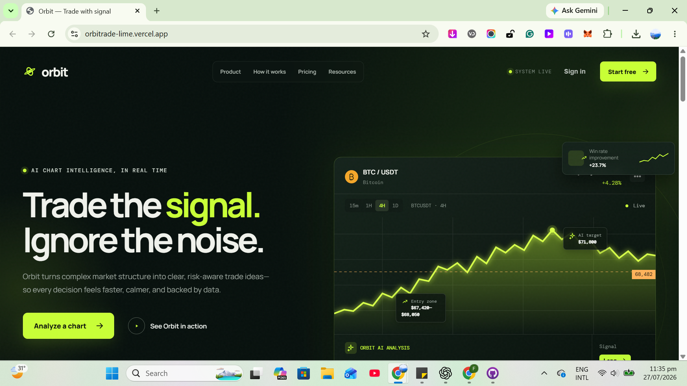
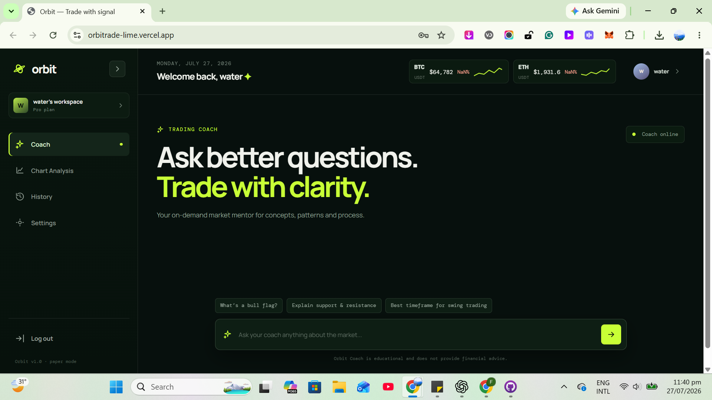
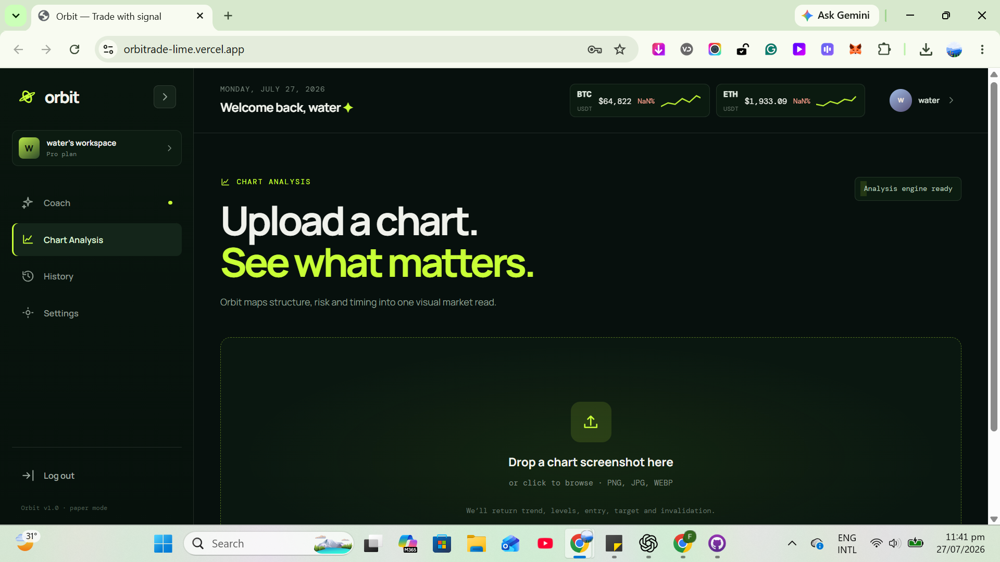

# Orbit — AI Crypto Chart Intelligence

Orbit is a responsive AI-powered trading workspace for crypto traders. It turns chart questions and chart screenshots into structured, visual market insights so traders can analyze faster, follow a calmer process, and make more consistent decisions.

## Live product

**Live URL:** [https://orbitrade-lime.vercel.app/](https://orbitrade-lime.vercel.app/)

## 1. Product overview

### The problem Orbit solves

Crypto traders often have to combine charting tools, market news, indicators, tutorials, and unstructured AI chat before they can form a trading plan. That creates information overload and encourages emotional decisions, late entries, weak risk management, and unreliable signal hunting.

Orbit gives traders one focused analysis workspace. It explains market concepts, reviews chart structure, highlights risk and invalidation, and stores the trader's analysis history behind authenticated access.

### Who Orbit is for

- Crypto day traders and scalpers
- Swing, spot, and futures traders
- Professional traders and retail investors
- Beginners building confidence and a repeatable process
- Intermediate traders seeking more consistency
- Advanced traders looking for AI-assisted confirmation
- Trading communities, educators, and research workflows

Orbit is an educational decision-support tool. It does not execute trades, guarantee returns, or provide personalized financial advice.

## 2. Features

### Public landing experience

- Premium, dark unicorn-startup visual system with lime signal accents
- Responsive layouts for desktop, tablet, and mobile
- Animated navigation and scroll-reveal sections
- Hero chart terminal with mock BTC market read, targets, and entry zone
- Product, workflow, performance, testimonial, CTA, and footer sections
- Clear calls to action for sign-in, free account creation, and chart analysis
- Mobile navigation drawer with accessible menu controls

### Authentication and account experience

- Supabase email/password sign up
- Supabase email/password sign in
- Email-confirmation flow support
- Persistent authenticated sessions
- Clean logout and return to the landing page
- User-specific display name, email, initials, and workspace identity
- Settings form for updating the display name

### Trading Coach

- Chat-style trading education interface
- Suggested questions for common concepts and workflows
- User questions render as right-aligned message bubbles
- AI answers always render as visual Insight Cards, never plain AI paragraphs
- Insight Cards include an eyebrow, title, summary, structured stats, tags, and caution context
- Covers market structure, support/resistance, chart patterns, timeframes, liquidity, volume, risk/reward, invalidation, and position sizing
- Conversation messages and sessions are saved to the authenticated user's history
- Skeleton Insight Card while the AI response is processing

### Chart Analysis

- Drag-and-drop or click-to-upload chart screenshots
- Supports PNG, JPEG, and WEBP images
- Private upload storage scoped to the authenticated user
- Server-side chart retrieval through a protected Supabase Edge Function
- Gemini vision analysis first, with OpenRouter fallback
- Structured market read containing:
  - Trend
  - Bias: Long, Short, or Wait
  - Confidence score
  - Support levels
  - Resistance levels
  - Entry zone
  - Stop-loss/invalidation
  - Targets
  - Checklist
  - Caution
- Visual market-read card instead of a plain text response
- Uploaded chart preview with mock support/resistance lines and highlighted entry zone
- Persistent educational disclaimer below every result
- Chart analysis records saved to private history

### Dashboard and market data

- Collapsible desktop sidebar
- Mobile sidebar drawer
- Coach, Chart Analysis, History, Settings, and Logout navigation
- Dynamic authenticated greeting and profile menu
- Live-looking BTC and ETH ticker strip
- Binance public WebSocket mini-ticker data with no API key required
- Responsive history list for saved coach conversations and chart analyses
- Responsive settings form
- Mobile-safe rendering for the hero chart and dashboard visual effects

## 3. AI feature and system prompt

Orbit's AI runtime is implemented in the Supabase Edge Function:

`supabase/functions/orbit-api/index.ts`

The prompt is defined in the `systemPrompt` constant and is sent to both AI providers:

- Gemini: `systemInstruction`
- OpenRouter: a `system` chat message

### Provider strategy

1. The user submits a Coach question or chart image.
2. The browser calls the protected `orbit-api` Edge Function.
3. The Edge Function validates the authenticated user.
4. Gemini is called first.
5. If Gemini fails, OpenRouter is called automatically.
6. The response is parsed as JSON and validated against the required schema.
7. The result is saved to Supabase and returned to the dashboard.

### Current system-prompt behavior

The default Orbit prompt instructs the model to:

- Act as an expert crypto-market education coach.
- Be rigorous, calm, and risk-first.
- Never promise profit, certainty, or a trade outcome.
- Treat every answer as educational, not financial advice.
- Explain market structure, liquidity, volume, trend, multi-timeframe context, risk/reward, invalidation, and position sizing precisely.
- Never invent chart values or claim to see data that was not supplied.
- Recommend waiting when evidence is insufficient.
- Return valid JSON only, matching the requested Coach or Chart Analysis schema.

### Response schemas

Coach responses are validated for:

```text
eyebrow, title, summary, bullets, stats, tags, caution
```

Chart responses are validated for:

```text
trend, bias, confidence, support, resistance, entry_zone,
stop_loss, targets, summary, checklist, caution
```

This structured-response requirement is central to Orbit's product identity: AI output becomes a visual decision component instead of another generic chatbot paragraph.

## 4. Tools, services, and models

### Frontend

- React
- Vite
- JavaScript/JSX
- CSS with responsive breakpoints and custom visual effects
- `@supabase/supabase-js`

### Backend and infrastructure

- Supabase Authentication for email/password accounts and sessions
- Supabase Postgres for profiles, conversations, messages, chart analyses, and preferences
- Supabase Row Level Security for user-owned data
- Supabase private Storage bucket for chart uploads
- Supabase Edge Functions for protected AI orchestration
- Vercel for the live frontend deployment
- GitHub for source control

### AI and market data

- Google Gemini API, with `gemini-2.5-flash` as the primary model
- OpenRouter free model routing as the automatic fallback
- `openrouter/free` vision fallback configuration for chart images
- Binance public WebSocket mini-ticker stream for BTC/ETH prices

### Security model

- Gemini and OpenRouter keys are stored only in Supabase Edge Function Secrets.
- The browser never receives provider API keys.
- The frontend only uses the Supabase project URL and publishable key.
- Chart files are stored in a private bucket under the authenticated user's ID.
- Edge Function requests require an authenticated Supabase session.
- `.env` is ignored by Git and must never be committed.

## 5. Screenshots

Replace the placeholders below with screenshots from the deployed application. Suggested files:








> Create a `docs/screenshots/` folder and add the image files using the names above, or update the image paths to match your screenshots.

## 6. Environment variables

### Frontend `.env`

Create a local `.env` file in the project root. Do not commit it.

```env
VITE_SUPABASE_URL=https://your-project-ref.supabase.co
VITE_SUPABASE_PUBLISHABLE_KEY=your_supabase_publishable_key
```

For Vercel, add the same variables in **Project Settings → Environment Variables** for the Production environment, then redeploy.

### Supabase Edge Function Secrets

Add these in **Supabase → Edge Functions → Secrets**:

```text
GEMINI_API_KEY=...
OPENROUTER_API_KEY=...
GEMINI_MODEL=gemini-2.5-flash
OPENROUTER_VISION_MODEL=openrouter/free
```

The AI provider keys must not be placed in the Vercel frontend environment or committed to GitHub.

## 7. How to run locally

### Requirements

- Node.js 18 or newer
- npm
- A Supabase project configured with the Orbit schema and Edge Function

### Install and start

```powershell
git clone https://github.com/dreamax-freelancer/orbitrade.git
cd orbitrade
npm install
```

Create `.env` with the frontend variables shown above, then run:

```powershell
npm run dev
```

Open the local URL printed by Vite, usually:

```text
http://localhost:5173
```

To test the production build locally:

```powershell
npm run build
npm run preview
```

## 8. Supabase setup checklist

1. Create or select the Orbit Supabase project.
2. Configure email/password authentication.
3. Add the local and deployed URLs under **Authentication → URL Configuration**.
4. Apply the migration in `supabase/migrations/20260727_chart_uploads.sql`.
5. Create the private `chart-uploads` Storage bucket and user-scoped policies.
6. Deploy `supabase/functions/orbit-api/index.ts` as the `orbit-api` Edge Function.
7. Add the Gemini/OpenRouter secrets listed above.
8. Test sign up, email confirmation, sign in, Coach, Chart Analysis, History, Settings, and logout.

To deploy the Edge Function with the Supabase CLI:

```powershell
supabase functions deploy orbit-api --project-ref your-project-ref
```

## 9. Recommended product test flow

1. Open the [live Orbit app](https://orbitrade-lime.vercel.app/).
2. Create a test account with email/password.
3. Confirm the email if email confirmation is enabled.
4. Sign in and verify the authenticated name and email appear in the dashboard.
5. Ask the Coach a suggested question and confirm the answer appears as an Insight Card.
6. Upload a crypto chart screenshot and confirm the visual market read appears.
7. Open History and verify the Coach session or chart analysis is saved.
8. Open Settings, change the display name, save, and refresh.
9. Test the same flow at mobile width.
10. Log out and confirm the landing page returns without requiring a refresh.

## 10. Project structure

```text
orbitrade/
├─ src/
│  ├─ main.jsx                 # React screens, dashboard, Coach, chart analysis
│  ├─ styles.css               # Landing and dashboard design system
│  └─ supabase.js              # Browser Supabase client
├─ supabase/
│  ├─ functions/orbit-api/
│  │  └─ index.ts              # Authenticated AI orchestration and persistence
│  └─ migrations/
│     └─ 20260727_chart_uploads.sql
├─ .env.example
├─ package.json
└─ README.md
```

## Disclaimer

Orbit is an educational market-analysis product. It is not financial advice, does not execute trades, and does not guarantee any result. Users should independently verify information, manage risk, and make their own decisions.
